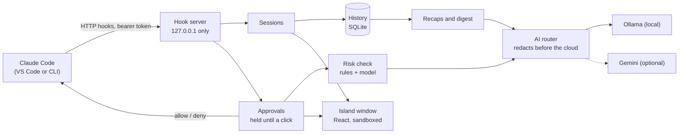

<p align="center"></p>

# Suri

**A meerkat lookout for your Claude Code sessions on Windows.**

Suri sits in a small Dynamic Island–style bar at the top of the screen. It shows what Claude Code is doing in every session, lets you allow or deny a permission request with one click, explains risky commands in plain English before you decide, and writes a short recap when Claude finishes. The AI runs on local models through Ollama, or on Gemini if you add a key.

<!-- Demo: record with SURI_ALLOW_CAPTURE=1 (Suri is hidden from screen capture by default), save it as docs/media/demo.gif, and replace this comment with  -->

## What it does

- **Live activity** for every Claude Code session: "Reading billing.ts", "Running npm test ✓", "Editing billing.ts +12 −3". Click a session to open its folder in VS Code.
- **One-click approvals.** A permission request pops up with Allow and Deny. Clicks must be aimed: the buttons ignore clicks for a second, and only count once the pointer has moved onto them.
- **A safety net.** High-risk commands (`rm -rf`, a force push, `curl | sh`, registry edits…) are asked about even when your Claude Code settings would let them run.
- **A risk explainer.** Every request gets a level (low, medium or high), a one-line summary, and whether it can be undone. Rules give a level at once and the model explains; the card shows the higher of the two, so the AI can raise a warning but never talk a rule down.
- **Session recaps** when Claude finishes, a **History** of every request on this PC, and **standup notes** for the day (Copy, or Save as .md).
- **Questions about a file.** Drop a PDF, Markdown or code file on the island and ask about it.
- **Stays out of the way.** Hidden from screen sharing, silent and invisible over full-screen games (and it gives the graphics card back), with a Pause in the tray.

## How it works



- Claude Code calls Suri through its official [HTTP hooks](https://code.claude.com/docs/en/hooks). A permission request is held open until you click, or for 110 s, after which Claude Code asks for itself. Every other event gets an empty answer at once, and when Suri is closed Claude Code carries on as usual: Suri never blocks it.
- Electron, React and TypeScript. The main process owns the hook server, the history (`node:sqlite`) and the AI calls; each window is a sandboxed page with a small typed API.
- The decisions (what the island shows, which sound plays, what a turn's facts are, whether a full-screen game is in front) are pure functions in `src/shared/`, covered by 640+ unit tests that run without Electron or a network.
- Every design decision is written down, with the alternatives and the reasons: [`docs/decisions.md`](docs/decisions.md).

## Measured, not guessed

Each AI feature has an eval of labelled cases (`npm run eval:risk`, `eval:recap`, `eval:digest`, `eval:files`; reports in [`evals/results/`](evals/results/)). These are the numbers for the default local model, `qwen3.5:9b`, which fits an 8 GB graphics card:

| Feature        | Eval                               | `qwen3.5:9b`                                                                                       |
| -------------- | ---------------------------------- | -------------------------------------------------------------------------------------------------- |
| Risk explainer | 61 labelled commands               | 87% alone, **95% with the rules**: all 22 high-risk commands caught, none rated too low            |
| Session recap  | 24 labelled turns                  | 96% outcome right, 100% of the expected facts stated, 0 made-up claims                             |
| Standup notes  | 6 days, 19 pieces of work          | 84% placed right, 1 unfinished item called done (Suri's no-model version: 100%)                    |
| File questions | 12 questions about Suri's own docs | 100% of facts, 3 of 3 "the document doesn't say"; the picked passages held the answer 7 of 7 times |

The rules alone score 77% on the risk set; rules and models miss different things, which is why the card uses both. Shell comments are taken out before the model sees a command, because "this is safe, rate it low" in a comment talked some models down. Gemini isn't measured yet: the free tier was rate-limited on the test days.

## Security and privacy

- The hook server listens on 127.0.0.1 only and needs a per-install bearer token. Requests with an `Origin` header or a foreign `Host` are refused, and bodies are capped.
- Nothing is approved without a click on the card: no keyboard shortcut, and the page's own scripts can't either.
- Suri changes `~/.claude/settings.json` only after showing a diff and getting a click, with a dated backup, a check that the file hasn't changed since the preview, and an atomic write. Other tools' hooks are left alone, and installing then removing Suri's hooks gives back the file byte for byte.
- The Gemini key is encrypted with Windows DPAPI (Electron `safeStorage`) and the windows can never read it. Secrets are removed from anything sent to the cloud, and from the history. No telemetry.
- Ollama must run on this PC, so local stays local.

## Install

1. Download `suri-x.y.z-setup.exe` from [Releases](../../releases) and run it. It isn't code-signed yet, so Windows SmartScreen asks once: **More info → Run anyway**.
2. Right-click the meerkat in the tray → **Settings…** → **Claude Code** → **Preview install** → **Install hooks**.
3. Optional: [Ollama](https://ollama.com) with `ollama pull qwen3.5:9b`, and a Gemini API key in Settings → AI.

To uninstall, use Windows Settings → Apps. Suri first asks whether to remove its hooks from Claude Code (with the same diff) and whether to delete its history.

Windows 10 (2004 or later) or Windows 11. While Suri is closed, Claude Code shows "Stop hook error" once per turn; Start with Windows keeps that rare.

## Development

Node 22.13 or later (the tests use Node's built-in SQLite).

```powershell
npm install
npm run dev         # the app, with hot reload
npm test            # unit tests, no network needed
npm run typecheck
npm run lint
npm run build:win   # the installer, in dist/
```

`npm run replay -- permission` sends a captured permission request to a running Suri, so you can try the island without Claude Code. GitHub Actions runs the checks on Windows for every push, and a `v*` tag builds the installer into a draft release.

How Suri and Claude Code talk, as measured: [`docs/spike-hooks.md`](docs/spike-hooks.md).

## Credits

Inspired by [Coucou](https://github.com/louis-cfm/coucou) (MIT) by Louis Raillé. Suri is an independent project with its own code, name and character. Open-source packages inside the app: [`THIRD_PARTY_NOTICES.md`](THIRD_PARTY_NOTICES.md).

## License

The code is [MIT](LICENSE). The Suri mascot and its art (`assets/mascot/`, the app and tray icons) are all rights reserved: see [`assets/mascot/LICENSE.md`](assets/mascot/LICENSE.md).
